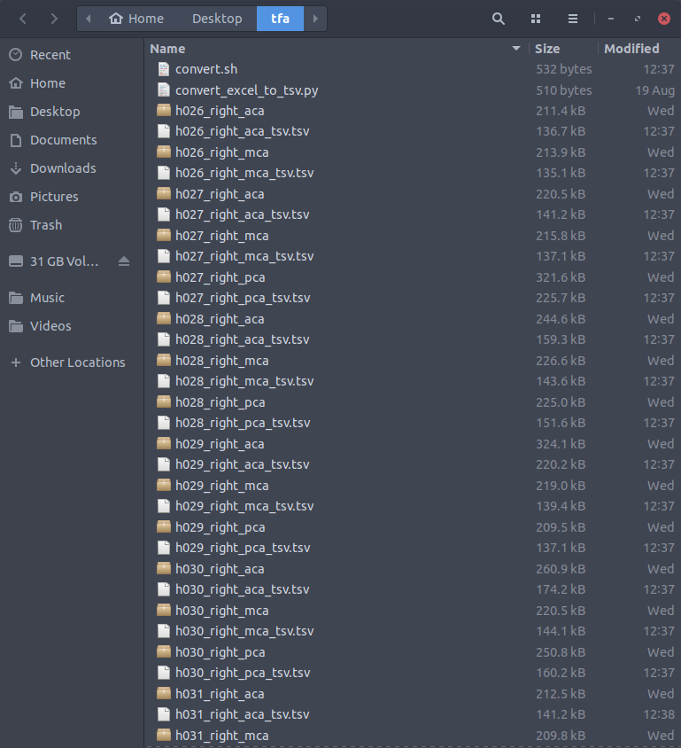
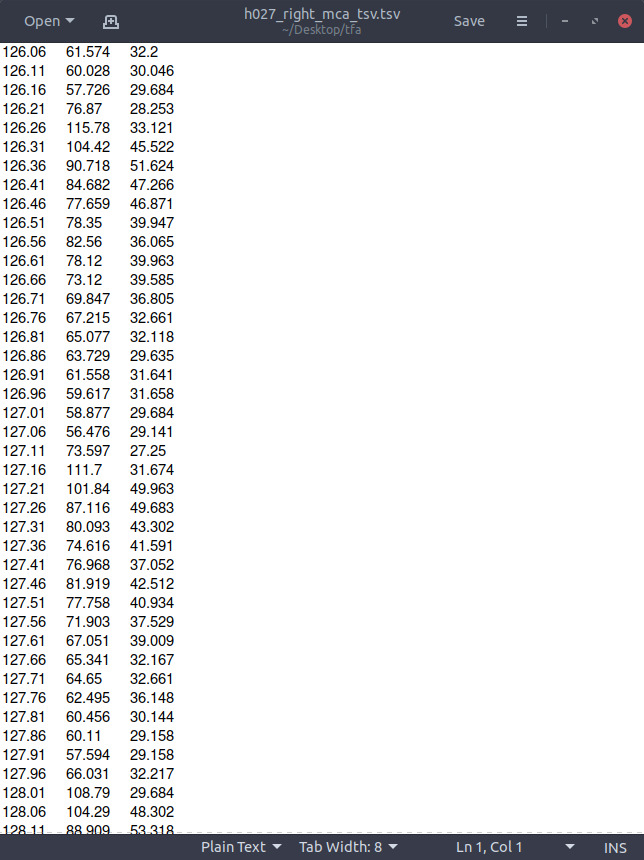
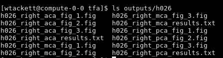
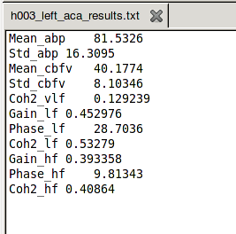
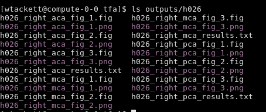

# Autoregulation
*Started on Aug 20, 2019*

Tranfer function analysis of blood pressure and CBFv for studying autoregulation in cerebral arteries.

# Setting things up

Here is the BOX folder with all the code, as well as a cohort of subjects already done which give an idea of how things should be set up: [https://upenn.app.box.com/folder/84579221507](https://upenn.app.box.com/folder/84579221507)

Convert the xlsx files into tab-separated-value files 

* Assume the excel files are named like so:

RECAST H026 RIGHT ACA.xlsx

* Put the excel files into one folder. Put **convert.sh** and **convert_excel_to_tsv.py**** **in the same folder. 

* In the terminal, run** chmod +x convert.sh** to make the script executable

* Make sure you have [Python 3](https://www.python.org/downloads/mac-osx/) and [pandas](https://pypi.org/project/pandas/) installed. If not, do **pip install pandas** from the command line

* Run **./convert.sh**** **. This will convert all the excel files into tsvs and rename them so that there are underscores in between subject name, hemisphere, and artery, resulting in a directory that looks like this:

With tsv files that look like this:

Prep the transfer function analysis

* If not done already, make a folder with these sub-folders and files

* Copy all the tsv files into **Inputs**

* In **outputs**, make a folder with each subject name (e.g. **h019**) by hand or run **makedirs.sh **in the directory and change the numbers at the top of that script to reflect the subjects you want

# Running the analysis

* The matlab file, **run_tfa.m**, performs the analysis by parsing the name, hemisphere and artery for a given tsv file, getting the time, ABP, and CBF time series from the columns in the file and sending that data to the **tfa_car.m **program which does the heavy lifting of the transfer function analysis. It then filters out the fields we want and arranges them into a key-value pairs which it saves as a text file. It also saves the figures as .figs (which are only openable in matlab...we’ll convert them later to PNG)

* IMPORTANT: in **run_tfa.m**, there are paths defined on line 4, line 74 and line 86. Edit these to your own path

* Since **run_tfa.m **only processes one subject at a time, I wrote a wrapper script to loop through all the subjects and call Matlab to run **run_tfa.m** for each one. This is **batch_run_tfa.sh**. NOTE that it will loop through ALL subjects in the input folder. If some of them are already done, the simplest solution would be to temporarily put them in a different folder, run **batch_run_tfa.sh**, and then put them back in the original **inputs** folder. 

* IMPORTANT: like above, edit the paths at the beginning of **batch_run_tfa.sh** to reflect your setup

* Run **./batch_run_tfa.sh**. You’ll start to see something like this:

* All the results will be saved in each subject’s folder in **outputs/** 

* There will be a text file for each artery and side that looks like this:

* And there will be three figures that look like this:

* Since they’re .fig files and completely useless, we convert them to the useful PNG format, using **batch_convert.sh**, which runs **export_figs.m** to do the conversion for each figure

* IMPORTANT: like above, edit the paths at the beginning of **batch_convert.sh** to reflect your setup

* Now the **output/h0xx** folder looks like this:

* And we’re done! You can load those text files into an excel file and they should fit to the cells automatically and they’re ready to do group-level stats on.
